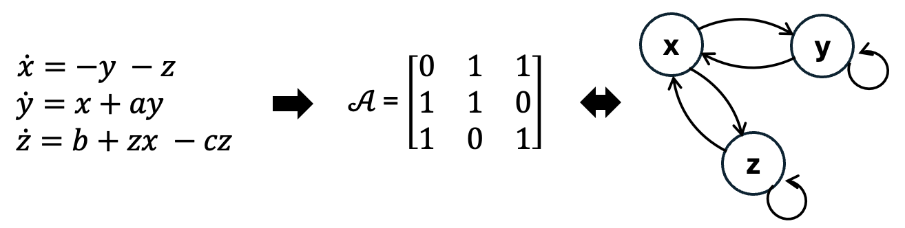

# CausalDynamics

| Resource | Information |
|----|----|
| Git + DOI | [Git](https://github.com/MaRDI4NFDI/) [12.3456/zenodo.11234567](https://doi.org/) |
| Short Description | CausalDynamics is a large-scale benchmark and extensible data generation framework designed to advance the structural discovery of dynamical causal models. In this notebook, we present the datasets in the benchmark. |

: {.striped}

## Introduction

Most existing benchmarks for causal discovery are built on synthetic data from static causal graphs or auto-regressive models, and real-world examples that exist lack a fully resolved causal ground truth. As a result, most methods are validated on toy systems or real-world data that fail to capture continuous state-space developments, complex feedback loops, stochasticity, and regime shifts. This is making it impossible to isolate algorithmic limitations from dataset characteristics. The paper *CausalDynamics: A large‐scale benchmark for structural discovery of dynamical causal models* (@herdeanu2025causaldynamics) developed jointly by kausable GmbH and Columbia University addressed these issues and was accepted at NeurIPS 2025 (Datasets & Benchmarks Track). Next to the benchmark collection presented here, users of their Python package [*causaldynamics*](https://github.com/kausable/CausalDynamics) can generate custom datasets.

## Statistical Model

We refer to the paper *CausalDynamics: A large‐scale benchmark for structural discovery of dynamical causal models* (@herdeanu2025causaldynamics) for the details of the statistical model:

**Dynamical system.** For each time $t \in \mathbb{R}_{\geq0}$, we characterize a dynamical system with an associated state $x(t) \in \mathbb{R}^N$ for $N \in \mathbb{N}$. In general, the description of the system dynamics are given through differential equations of the form: $$
    \frac{dx}{dt} = f(t,x) + \delta \frac{dW_t}{dt}
$$ where $f$ is a function, the solution $x(t)$ depends on the initial condition $x(t_0) = x_0$ at time $t_0$, and $\delta$ is the noise amplitude of the Brownian process $W_t$. When $\delta = 0$, this equation becomes *ordinary differential equations* (ODEs) whereas $\delta > 0$ yields *stochastic differential equations* (SDEs).

**Structural causal models.** We describe causal mechanisms through structural causal models (SCMs) such that a system of $d$ random variables $\boldsymbol{x} = \{x_1, \dots, x_d \}$ is expressed as an arbitrary function $f^k$ of its direct parents (causes) $\boldsymbol{x}_{\text{PA}_k}$ and an exogenous distribution of noise $\epsilon^k$: $$
    x_k := f^k(\boldsymbol{x}_{\text{PA}_k}, \epsilon^k) \text{, for } k = 1, \dots, d
$$ For dynamical systems, we can combine the previous equations for a collection of $d$ differential equations to define *structural dynamical causal models* (SDCM): $$
\frac{\text{d}}{\text{d}t} x_{k,t} := f^k(\boldsymbol{x}_{{\text{PA}_k,t}}, \delta), \text{with } x_{k,0} = x_k(0)
$$ where $k \in \{1, \dots, d\}$.

**Causal graph.** The structural assignment of the SCM induces a *directed acyclic graph* (DAG) $\mathcal{G} = (\mathcal{V},\mathcal{E})$ over the variables $x_k$. $\mathcal{G}$ includes nodes $v_k \in \mathcal{V}$ for every $x_k \in \boldsymbol{x}$ and directed edges $(k,i) \in \mathcal{E}$ if $x_k \in \boldsymbol{x}_{\text{PA}_i}$ \cite{ormaniec2025standardizingstructuralcausalmodels}. Edges are represented in a squared *adjacency matrix* $\mathcal{A} \in \mathbb{R}^{k\text{x}i}$ with each entry $a_{ki} \in \mathcal{A}: a_{ki} = 1$ if $x_i$ is causally impacted by $x_k$, else $a_{ki} = 0$. A corresponding graphical representation of the DAG is shown in Figure below:


## The Benchmark on Huggingface

The benchmark is organized into three complexity tiers: (1) a simple tier with true causal graphs for hundreds of 3D chaotic dynamical systems; (2) a coupled tier that adapts a graph generation algorithm to combine deterministic and stochastic dynamical systems via periodic coupling functions, constructing thousands of complex graph structures; and (3) a climate tier with true causal graphs for two idealized atmosphere-ocean models, including multiple coupling experiments for different modes of variability.

All data is available on [Huggingface](https://huggingface.co/datasets/kausable/CausalDynamics). The following display visualizes three exemplary graphs and time series realizations.

```{r, include=FALSE}
# without an initial R chunk, jupyter does not call Python.. -> ignore.
```

```{python}
from datasets import load_dataset
ds = load_dataset("kausable/CausalDynamics")
```

```{python}
#| echo: false
import netCDF4
import numpy as np
import networkx as nx
import matplotlib.pyplot as plt
import matplotlib as mpl

def build_causal_graph(nc):
    """Build a NetworkX DiGraph from a CausalDynamics NetCDF file."""
    adj = np.array(nc.variables["adjacency_matrix"][:])           # (node_in, node_out) instant edgesb
    if 'adjacency_matrix_time_edges' in nc.variables.keys():
        adj_time = np.array(nc.variables["adjacency_matrix_time_edges"][:])  # lagged edges
    n = adj.shape[0]

    G = nx.DiGraph()
    G.add_nodes_from(range(n))

    for i in range(n):
        for j in range(n):
            if adj[i, j] > 0:
                G.add_edge(i, j, label="regular")
            if 'adjacency_matrix_time_edges' in nc.variables.keys():
                if adj_time[i, j] > 0:
                    G.add_edge(i, j, label="lagged")

    return G


def plot_scm_from_nc(
    raw_bytes,
    key=None,
    ax=None,
    title=None,
    figsize=(6, 5),
    node_size=900,
    font_size=9,
    root_node_color="grey",
    node_color="orange",
):
    """
    Plot the Structural Causal Model graph from a raw CausalDynamics NetCDF bytes object.
    Solid arrows = instantaneous edges, dashed arrows = lagged edges.
    Grey nodes = root nodes (no incoming causes), orange = non-root.
    """
    nc = netCDF4.Dataset("in-memory", memory=raw_bytes)
    G = build_causal_graph(nc)
    root_nodes = np.array(nc.variables["root_nodes"][:]).astype(bool)
    nc.close()

    if ax is None:
        fig, ax = plt.subplots(figsize=figsize)

    pos = nx.spring_layout(G, seed=42)

    node_colors = [root_node_color if root_nodes[n] else node_color for n in G.nodes()]

    nx.draw_networkx_nodes(G, pos, ax=ax, node_size=node_size, node_color=node_colors)
    nx.draw_networkx_labels(G, pos, ax=ax, font_size=font_size)

    # Categorize edges
    regular_edges, lagged_edges, both_edges = [], [], []
    edge_types = {}
    for u, v, d in G.edges(data=True):
        k = (u, v)
        edge_types.setdefault(k, {"regular": False, "lagged": False})
        if d.get("label") == "lagged":
            edge_types[k]["lagged"] = True
        else:
            edge_types[k]["regular"] = True

    for k, t in edge_types.items():
        if t["regular"] and t["lagged"]:
            both_edges.append(k)
        elif t["regular"]:
            regular_edges.append(k)
        else:
            lagged_edges.append(k)

    draw_opts = dict(ax=ax, arrowsize=20, width=2, connectionstyle="arc3,rad=0.15")
    if regular_edges:
        nx.draw_networkx_edges(G, pos, edgelist=regular_edges, style="solid", **draw_opts)
    if lagged_edges:
        nx.draw_networkx_edges(G, pos, edgelist=lagged_edges, style="dashed", **draw_opts)
    if both_edges:
        nx.draw_networkx_edges(G, pos, edgelist=both_edges, style="-.", **draw_opts)

    # Legend
    from matplotlib.lines import Line2D
    legend_elements = [
        Line2D([0], [0], color="black", lw=2, linestyle="-",  label="Instantaneous"),
        Line2D([0], [0], color="black", lw=2, linestyle="--", label="Lagged"),
        Line2D([0], [0], marker="o", color="w", markerfacecolor=root_node_color,
               markersize=10, label="Root node"),
        Line2D([0], [0], marker="o", color="w", markerfacecolor=node_color,
               markersize=10, label="Node"),
    ]
    ax.legend(handles=legend_elements, loc="best", fontsize=12)
    #ax.set_title(title or (key or "Causal Graph"))
    ax.axis("off")
    return ax


# ── Combined plot: SCM graph + 3D trajectories ───────────────────────────────
def plot_sample(ds, ds_row):
    raw = ds["train"]["nc"][ds_row]
    key = ds["train"]["__key__"][ds_row]
    print("key =", key)

    nc = netCDF4.Dataset("in-memory", memory=raw)
    time_series = np.array(nc.variables["time_series"][:])  # (T, system, node, dim)
    root_nodes  = np.array(nc.variables["root_nodes"][:]).astype(bool)
    n_nodes = time_series.shape[2]
    nc.close()

    # Left: causal graph
    max_per_row = 4
    n_row = int(np.ceil((n_nodes + 1) / max_per_row))
    fig = plt.figure(figsize=(5 * 4, 5 * n_row + 1))
    ax_graph = fig.add_subplot(n_row, max_per_row, 1)
    plot_scm_from_nc(raw, key=key, ax=ax_graph)

    # Right: 3D trajectories (system=0)
    data = time_series[:, 0, :, :]  # (T, node, dim)
    final_state = data[-1]
    colors = ["grey" if root_nodes[n] else "orange" for n in range(n_nodes)]
    for node in range(n_nodes):
        ax = fig.add_subplot(n_row, max_per_row, node + 2, projection="3d")
        traj = data[:, node, :]
        ax.plot(*traj.T, c=colors[node], alpha=0.7)
        ax.scatter(*final_state[node], c=colors[node],
                   marker="*" if root_nodes[node] else "o",
                   s=200 if root_nodes[node] else 100)
        ax.set_title(f"{'Root ' if root_nodes[node] else ''}Node {node}", fontsize=19)
        ax.set_xlabel("X"); ax.set_ylabel("Y"); ax.set_zlabel("Z")
        ax.set_box_aspect([1, 1, 1])
        ax.set_axis_off()

    plt.tight_layout()
    plt.show()
    return fig
```

```{python}
#| eval: false
import netCDF4
import numpy as np
import networkx as nx
import matplotlib.pyplot as plt
import matplotlib as mpl

def build_causal_graph(...):
    """Build a NetworkX DiGraph from a CausalDynamics NetCDF file."""
    ...

def plot_scm_from_nc(...):
    """
    Plot the Structural Causal Model graph from a raw CausalDynamics NetCDF 
    bytes object.
    Solid arrows = instantaneous edges, dashed arrows = lagged edges.
    Grey nodes = root nodes (no incoming causes), orange = non-root.
    """
    ...

def plot_sample(ds, ds_row):
    """ Combined plot: SCM graph + 3D trajectories """
    ...
```

```{python}
fig = plot_sample(ds, ds_row=41)
fig = plot_sample(ds, ds_row=24)
fig = plot_sample(ds, ds_row=194)
```

## Summary of the Benchmark Collection

In total the benchmark contains 585 simple, 14,096 coupled, and 12 climate graphs (in total 14,693 graphs). Each graph constitutes 5 randomly initialized trajectories of 1,000 time steps. The HuggingFace dataset with contains 152,077 rows because each graph is replicated across multiple parameter settings (noise, confounder, timelag, activation, seed).

```{python}
#| eval: false
import re
from collections import Counter, defaultdict

def parse_key(key):
    """Parse a __key__ string into structured metadata."""
    ...

def summarize_dataset(keys):
    """Summarize and print structured metadata."""
    ...

keys = ds["train"]["__key__"][:]
records = summarize_dataset(keys)
```

```{python}
#| echo: false
import re
from collections import Counter, defaultdict

def parse_key(key):
    """Parse a __key__ string into structured metadata."""
    parts = key.split("/")
    domain = parts[0]  # 'climate' or 'coupled'
    info = {"domain": domain, "raw": key}

    if domain == "climate":
        info["subdomain"] = parts[1]
        filename = parts[-1]
        m = re.match(r"([A-Z0-9]+)_N(\d+)_T(\d+)", filename)
        if m:
            info["driver"] = m.group(1)
            info["N"] = int(m.group(2))
            info["T"] = int(m.group(3))

    elif domain == "coupled":
        config_str = parts[1]
        filename = parts[-1]

        # Parse config
        for param in ["coupling", "noise", "systems", "confounder",
                      "standardize", "timelag", "activation"]:
            m = re.search(rf"{param}=([^_]+)", config_str)
            if m:
                val = m.group(1)
                # Type coerce
                if val in ("True", "False"):
                    val = val == "True"
                else:
                    try: val = int(val)
                    except ValueError:
                        try: val = float(val)
                        except ValueError: pass
                info[param] = val

        # Parse filename
        m = re.match(r"S([A-Z]+)_N(\d+)_T(\d+)_seed(\d+)", filename)
        if m:
            info["system_type"] = m.group(1)
            info["N"] = int(m.group(2))
            info["T"] = int(m.group(3))
            info["seed"] = int(m.group(4))

    return info


def summarize_dataset(keys):
    records = [parse_key(k) for k in keys]

    print("=" * 60)
    print(f"TOTAL SAMPLES: {len(records)}")
    print("=" * 60)

    # Domain split
    domains = Counter(r["domain"] for r in records)
    print(f"\n{'DOMAIN COUNTS':}")
    for d, c in domains.most_common():
        print(f"  {d}: {c}")

    # --- Climate ---
    climate = [r for r in records if r["domain"] == "climate"]
    if climate:
        print(f"\n--- CLIMATE ({len(climate)} samples) ---")
        print("  Subdomains:", Counter(r.get("subdomain") for r in climate))
        print("  Drivers:", Counter(r.get("driver") for r in climate))
        print("  N values:", Counter(r.get("N") for r in climate))
        print("  T values:", Counter(r.get("T") for r in climate))

    # --- Coupled ---
    coupled = [r for r in records if r["domain"] == "coupled"]
    if coupled:
        print(f"\n--- COUPLED ({len(coupled)} samples) ---")

        for field, label in [
            ("coupling",    "Coupling type"),
            ("system_type", "System type"),
            ("noise",       "Noise level"),
            ("systems",     "Num systems"),
            ("confounder",  "Confounder"),
            ("timelag",     "Time lag"),
            ("activation",  "Activation"),
            ("N",           "N (nodes)"),
            ("T",           "T (timesteps)"),
            ("seed",        "Seeds"),
        ]:
            c = Counter(r.get(field) for r in coupled)
            print(f"\n  {label}:")
            for val, cnt in sorted(c.items(), key=lambda x: str(x[0])):
                print(f"    {val}: {cnt}")

    return records


# Run on full dataset
keys = ds["train"]["__key__"][:]
records = summarize_dataset(keys)
```

## Usage

The primary use case is benchmarking causal discovery algorithms. Taking the time_series as input, running an algorithm allows for comparisons the inferred adjacency matrix against the ground-truth adjacency_matrix / adjacency_matrix_summary. The evaluation is done by comparing true and predicted adjacency matrices using AUROC, AUPRC, and Structural Hamming Distance (SHD). Candidate algorithms span constraint-based methods (PC, FCI), score-based methods (GES, NOTEARS), Granger causality, transfer entropy, PCMCI (for time-lagged effects), and neural/Koopman-based approaches. The tiered difficulty structure provides staged levels to isolate the limitations of causal discovery methodology.

## Citing this Notebook {.unnumbered}

Please cite @herdeanu2025causaldynamics and @Mareis_Haug_Drton_2025. 

When using the CausalDynamics benchmarking dataset, please give credit to the original authors: @herdeanu2025causaldynamics

## Additional Information {.unnumbered}

**License Information:** Please follow the above DOI for license information of data and code.